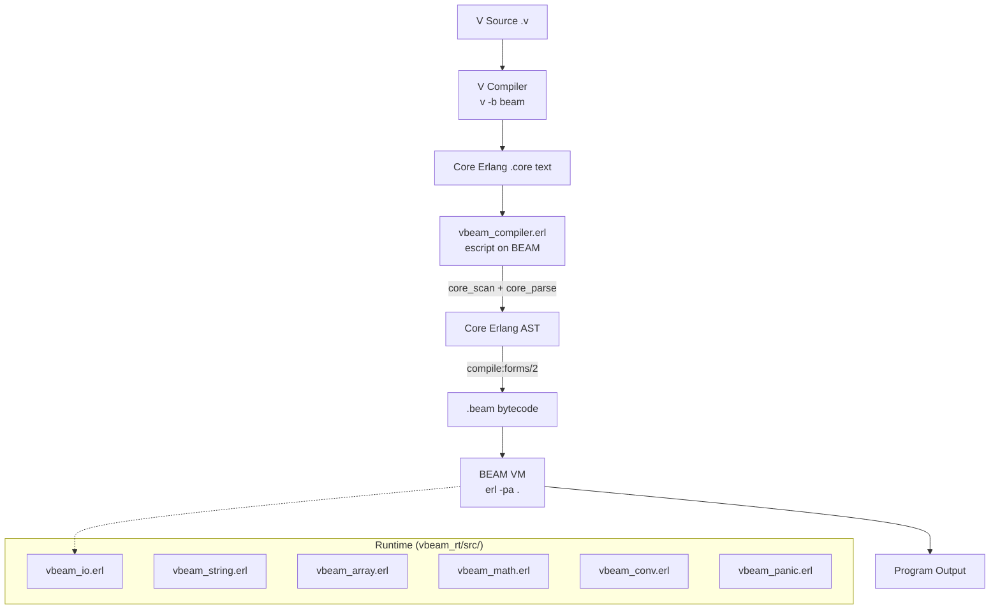
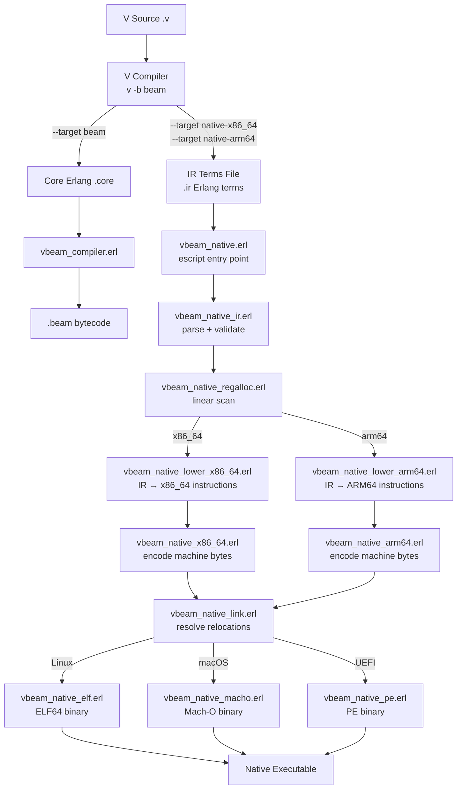
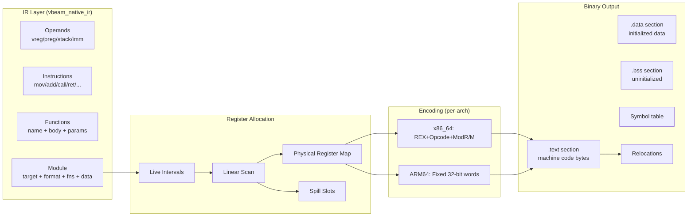
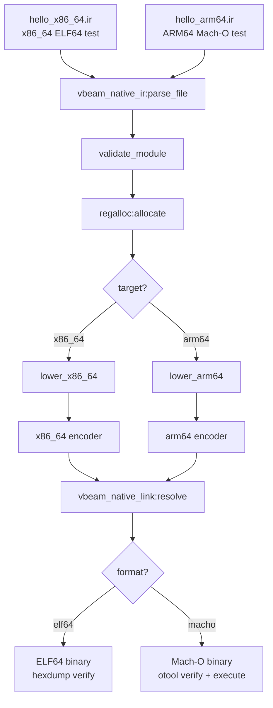

# Sketch: Native Machine Code Emission Backend (x86_64 + ARM64)

COVERS:
- vbeam_rt/src/vbeam_native.erl
- vbeam_rt/src/vbeam_native_ir.erl
- vbeam_rt/src/vbeam_native_regalloc.erl
- vbeam_rt/src/vbeam_native_x86_64.erl
- vbeam_rt/src/vbeam_native_arm64.erl
- vbeam_rt/src/vbeam_native_lower_x86_64.erl
- vbeam_rt/src/vbeam_native_lower_arm64.erl
- vbeam_rt/src/vbeam_native_elf.erl
- vbeam_rt/src/vbeam_native_macho.erl
- vbeam_rt/src/vbeam_native_pe.erl
- vbeam_rt/src/vbeam_native_link.erl
- vbeam_rt/test/hello_x86_64.ir
- vbeam_rt/test/hello_arm64.ir
- vbeam_rt/test/test_native.erl

## Current State (existing BEAM pipeline)

## New State (adding native code path)

## Data Flow Detail

## What I'm Changing
Adding 11 new Erlang modules to vbeam_rt/src/ that implement a complete native code emission pipeline. These modules run entirely on BEAM and produce standalone executables for x86_64 and ARM64.

## What Must NOT Break
- Existing BEAM compilation pipeline (Core Erlang path) is untouched
- Existing runtime modules (vbeam_io, vbeam_string, etc.) are not modified
- 21/21 runtime tests continue to pass
- 235/249 V examples continue to compile

## How I'll Verify It Works
- [x] IR module: parse/validate/pretty-print a test IR file
- [x] x86_64 encoder: verify MOV RAX,42 produces correct bytes (48 C7 C0 2A000000)
- [x] ARM64 encoder: verify ADD X0,X1,X2 produces correct 32-bit word
- [ ] ELF64: produce valid ELF header (check with hexdump)
- [ ] Mach-O: produce valid Mach-O header (check with otool or hexdump)
- [ ] Hello world: emit binary that prints "Hello" via syscall
- [ ] Fibonacci: emit binary that computes fib(35)=9227465
- [ ] Existing tests: ./scripts/test_runtime.sh still passes 21/21

## Integration Test Plan

