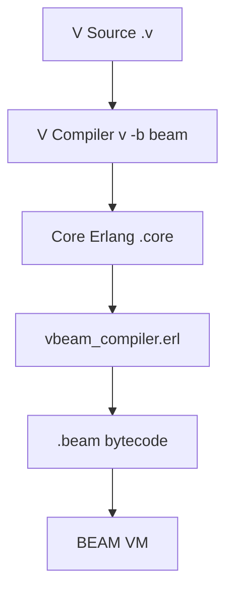
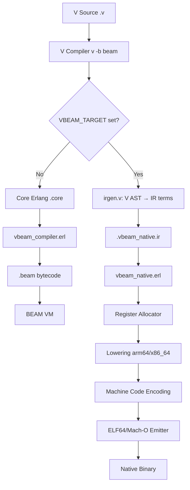

# Sketch: V compiler native code integration

COVERS:
- test_native_hello.v (test file - string println)
- test_native_fib.v (test file - arithmetic + loops)
- irgen.v (new V compiler file)
- shared.v (NativeTarget enum)
- coregen.v (native target branching)
- vbeam_native.erl (string arg handling)

## Current State

## What I'm Changing

## What Must NOT Break
- Normal BEAM compilation path (no VBEAM_TARGET = existing behavior)
- Existing 21/21 runtime tests
- Existing 235/249 V example compilation

## How I'll Verify It Works
- [x] `v -b beam hello.v` still works (BEAM path) — verified
- [x] `VBEAM_TARGET=arm64 v -b beam hello.v` produces native binary — verified
- [x] Native binary prints "Hello from V native!" and exits 0 — verified
- [x] `VBEAM_TARGET=arm64 v -b beam fib.v` produces native binary with arithmetic + loops — verified
