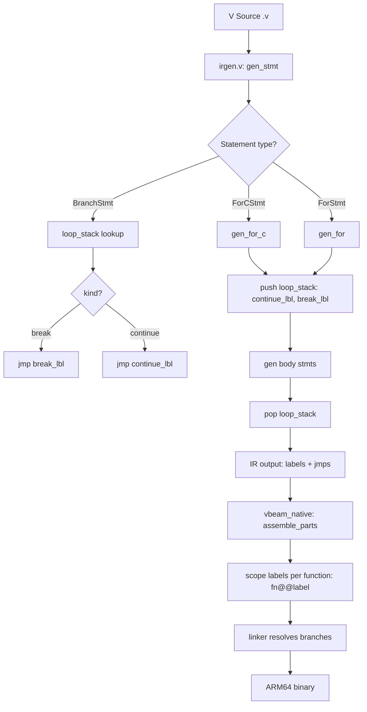

# Sketch: Add break/continue test for native IR backend

COVERS:
- test_native_break.v (NEW test file)
- irgen.v (already has break/continue support, just needs testing)

## Current State

## What I'm Changing
Adding a new test file `test_native_break.v` that exercises:
1. `break` in infinite `for {}` loop (ForStmt, no condition)
2. `continue` in `for i := 1; i <= n; i++` loop (ForCStmt)
3. `for x != 1` conditional loop (ForStmt with condition)
4. Complex expressions: `x * 3 + 1`, `x / 2`, `x % 2`

## What Must NOT Break
- Existing native tests: hello, fib, ifelse
- 21/21 BEAM runtime tests
- Label scoping (fn@@label) must work for new functions too

## How I'll Verify It Works
- [ ] Compile test_native_break.v with VBEAM_TARGET=arm64
- [ ] Run binary, verify: sum_until_break(10)=55, sum_odds(10)=25, collatz_steps(27)=111
- [ ] Existing native tests still pass
