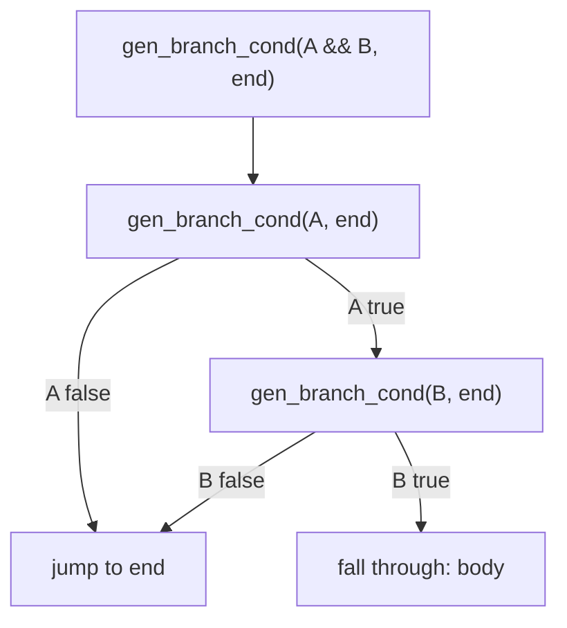
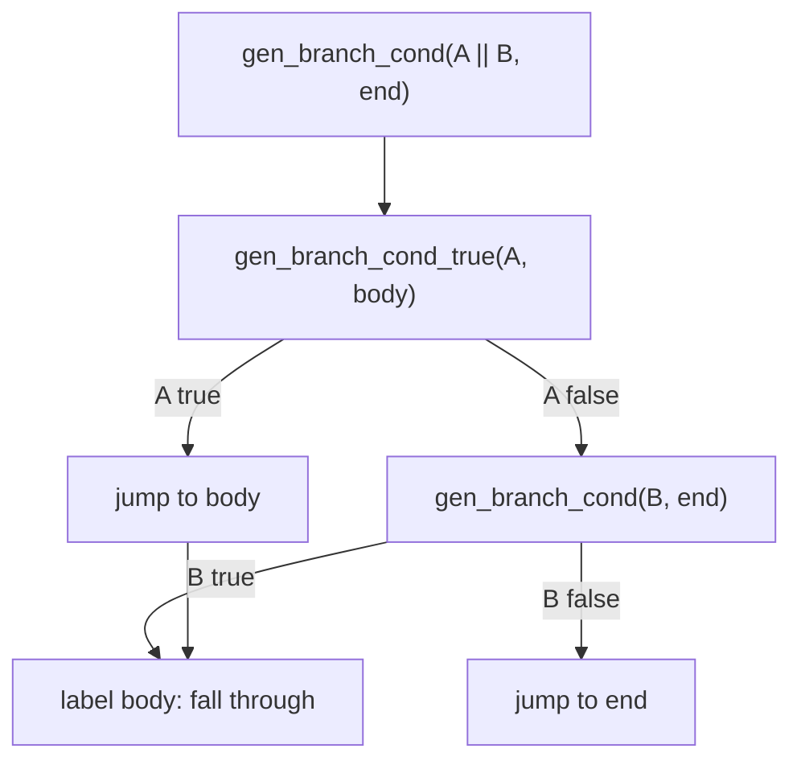

# Sketch: Test boolean AND/OR and compound assignments in native IR

COVERS:
- test_native_logic.v (NEW)
- irgen.v (gen_branch_cond modified for &&, ||)

## Short-circuit AND evaluation

## Short-circuit OR evaluation

## What I'm Changing
- Added `gen_branch_cond_true` (jump if TRUE) as complement to `gen_branch_cond` (jump if FALSE)
- `&&` in gen_branch_cond: sequential false checks
- `||` in gen_branch_cond: first true-jumps to body, else check second
- Added *=, /=, %= compound assignments
- New test file with clamp, in_range, compound_ops, complex_cond

## What Must NOT Break
- All existing native tests (hello, fib, ifelse, break)
- 21/21 BEAM runtime tests
- Simple comparisons still work (no regression in non-boolean conditions)

## How I'll Verify
- [ ] clamp(5,1,10)=5, clamp(-3,1,10)=1, clamp(20,1,10)=10
- [ ] in_range(-5)=1, in_range(50)=0, in_range(200)=1
- [ ] compound_ops(100)=2 (100*3=300, /2=150, %7=3... wait: 150%7=150-21*7=150-147=3)
- [ ] complex_cond(1,1,0)=1, complex_cond(0,0,1)=1, complex_cond(0,0,0)=0
