# Sketch: Phase 7 — Native Testing Infrastructure (QEMU + ARM64 + UEFI)

COVERS:
- scripts/test_native_arm64.sh
- scripts/test_native_x86_64_uefi.sh
- tests/native/hello.v
- tests/native/fibonacci.v
- tests/native/arithmetic.v
- tests/native/if_else.v
- tests/native/for_loop.v
- tests/native/break_continue.v
- tests/native/*.expected
- docs/native-testing.md

## Current State (Before Changes)

```mermaid
flowchart TD
    subgraph "Existing Test Infrastructure"
        RT[scripts/test_runtime.sh] -->|"for each .v"| COMPILE["V Compiler<br/>v -b beam foo.v"]
        COMPILE --> CORE[".core / .etf files"]
        CORE --> ERLC["erlc → .beam"]
        ERLC --> RUN["erl -noshell -s module main"]
        RUN --> COMPARE["Compare stdout<br/>vs .expected"]
    end

    subgraph "Existing Native IR Tests (manual)"
        IR_FILES["vbeam_rt/test/*.ir<br/>(hello_arm64.ir, fib_arm64.ir)"]
        IR_FILES -->|"manual erl -s vbeam_native"| NATIVE_BIN["ARM64 Mach-O / ELF64"]
        NATIVE_BIN -->|"manual ./a.out"| OUTPUT["stdout"]
    end

    subgraph "Native Compiler Pipeline"
        V_SRC["V Source (.v)"] -->|"VBEAM_TARGET=arm64"| IRGEN["irgen.v → .vbeam_native.ir"]
        IRGEN --> NATIVE_COMP["vbeam_native.erl"]
        NATIVE_COMP --> MACHO["vbeam_native_macho.erl<br/>(ARM64 Mach-O)"]
        NATIVE_COMP --> ELF["vbeam_native_elf.erl<br/>(x86_64 ELF)"]
        NATIVE_COMP --> PE["vbeam_native_pe.erl<br/>(x86_64 PE/UEFI)"]
    end

    style RT fill:#9f9
    style IR_FILES fill:#ff9
    style NATIVE_BIN fill:#ff9
```

**Gap**: No automated test runner for the native pipeline. Tests are run manually.

## What I'm Adding

```mermaid
flowchart TD
    subgraph "New: test_native_arm64.sh"
        A1{Detect Platform} -->|"ARM64 Mac"| A2["Run ./a.out directly"]
        A1 -->|"x86_64 Linux"| A3["Run via qemu-aarch64"]

        A_LOOP["For each tests/native/*.v"] --> A_COMPILE
        A_COMPILE["VBEAM_TARGET=arm64<br/>v -b beam $file"] --> A_IR[".vbeam_native.ir"]
        A_IR --> A_NATIVE["erl -s vbeam_native main<br/>→ a.out"]
        A_NATIVE --> A_RUN["Execute (direct or QEMU)"]
        A_RUN --> A_CMP["Compare vs .expected"]
        A_CMP --> A_REPORT["PASS/FAIL summary"]
    end

    subgraph "New: test_native_x86_64_uefi.sh"
        U_PREREQ{QEMU + OVMF?} -->|Yes| U_LOOP
        U_PREREQ -->|No| U_ABORT["Abort with instructions"]
        U_LOOP["For each tests/native/*.v"] --> U_COMPILE
        U_COMPILE["VBEAM_TARGET=x86_64<br/>VBEAM_FORMAT=pe<br/>v -b beam $file"] --> U_IR[".vbeam_native.ir"]
        U_IR --> U_NATIVE["erl -s vbeam_native main<br/>→ BOOTX64.EFI"]
        U_NATIVE --> U_EFI["Create EFI boot structure"]
        U_EFI --> U_QEMU["qemu-system-x86_64<br/>-bios OVMF.fd<br/>-serial stdio"]
        U_QEMU --> U_CMP["Capture serial, compare"]
        U_CMP --> U_REPORT["PASS/FAIL summary"]
    end

    subgraph "New: tests/native/"
        T1["hello.v + hello.expected"]
        T2["fibonacci.v + fibonacci.expected"]
        T3["arithmetic.v + arithmetic.expected"]
        T4["if_else.v + if_else.expected"]
        T5["for_loop.v + for_loop.expected"]
        T6["break_continue.v + break_continue.expected"]
    end
```

## What Must NOT Break

- Existing runtime tests (`scripts/test_runtime.sh`) -- not touched
- Existing V compiler -- not touched
- Existing native IR files in `vbeam_rt/test/` -- not touched
- The native compilation pipeline itself -- scripts only invoke it, don't modify it

## How I'll Verify It Works

- [ ] All test `.v` files use `module main` prefix (matching existing V convention)
- [ ] All `.expected` files have trailing newline (matching existing convention)
- [ ] Scripts detect platform correctly on ARM64 Mac
- [ ] Scripts handle missing prerequisites gracefully (QEMU, OVMF)
- [ ] Scripts exit with correct codes (0 = all pass, 1 = failures, 2 = config error)
- [ ] Color output matches existing `test_runtime.sh` style
- [ ] Timeouts prevent hangs on broken binaries
