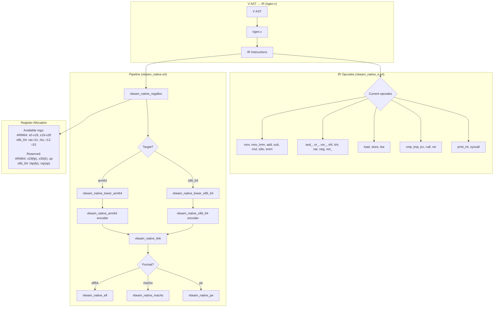
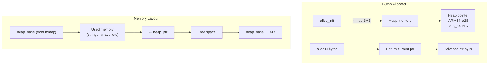
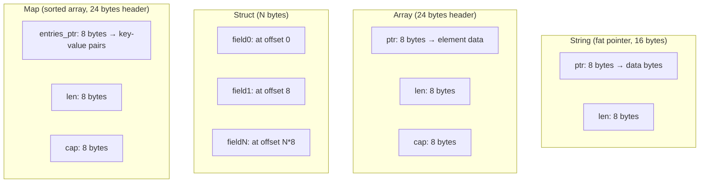
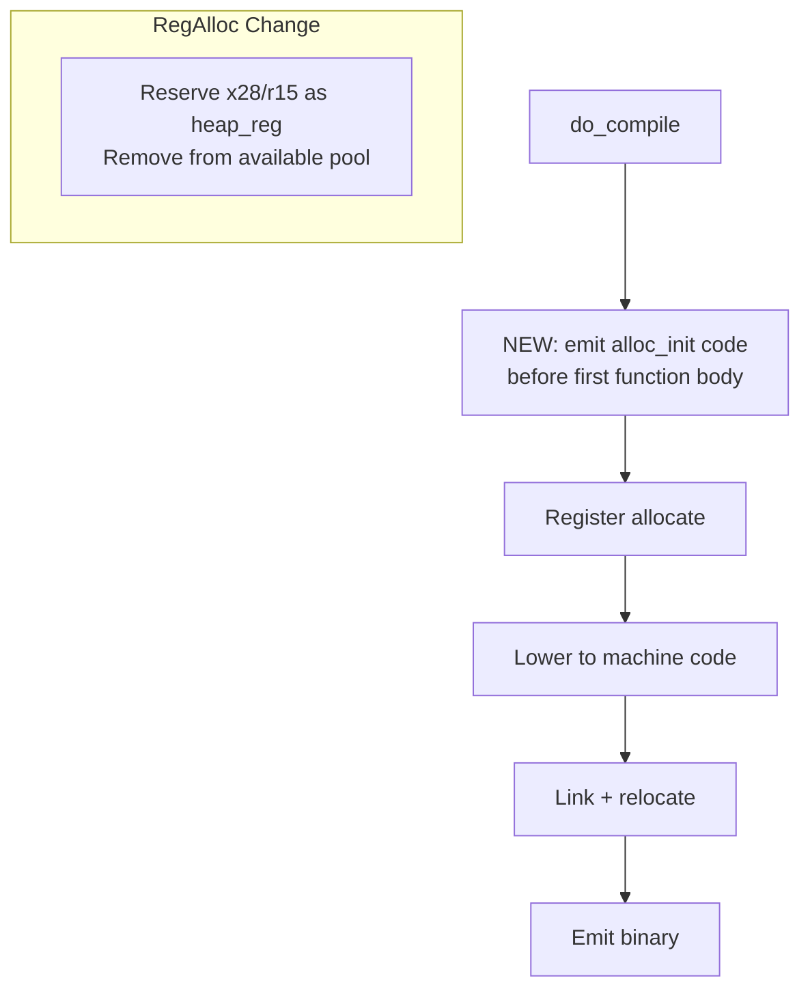

# Sketch: Phase 6 — Native Backend Data Types (strings, arrays, structs, maps, floats, methods)

COVERS:
- vbeam_rt/src/vbeam_native_alloc.erl (NEW)
- vbeam_rt/src/vbeam_native_ir.erl
- vbeam_rt/src/vbeam_native_lower_arm64.erl
- vbeam_rt/src/vbeam_native_lower_x86_64.erl
- vbeam_rt/src/vbeam_native_arm64.erl (minor additions)
- vbeam_rt/src/vbeam_native_x86_64.erl (minor additions)
- vbeam_rt/src/vbeam_native.erl (alloc init injection)
- vbeam_rt/src/vbeam_native_regalloc.erl (heap reg reservation + needs_heap fix)
- vbeam_rt/test/strings_arm64.ir (NEW test)
- vbeam_rt/test/arrays_arm64.ir (NEW test)
- vbeam_rt/test/structs_arm64.ir (NEW test)
- vbeam_rt/test/hello_arm64.ir (existing, regression test)

## Current State

## What I'm Changing

### New Module: vbeam_native_alloc.erl (bump allocator)

### New IR Opcodes (added to vbeam_native_ir.erl)

```mermaid
flowchart LR
    subgraph "String Opcodes"
        SL[string_lit Dst Bytes] --> SLen[string_len Dst Src]
        SLen --> SCmp[string_cmp Dst A B]
        SCmp --> SConcat[string_concat Dst A B]
        SConcat --> SPrint[print_str Src]
    end

    subgraph "Array Opcodes"
        ANew[array_new Dst ElemSize Cap] --> AGet[array_get Dst Arr Idx]
        AGet --> ASet[array_set Arr Idx Val]
        ASet --> ALen[array_len Dst Arr]
        ALen --> AApp[array_append Dst Arr Val]
    end

    subgraph "Struct Opcodes"
        StNew[struct_new Dst Size] --> FGet[field_get Dst Struct Off]
        FGet --> FSet[field_set Struct Off Val]
    end

    subgraph "Map Opcodes"
        MNew[map_new Dst] --> MGet[map_get Dst Map Key]
        MGet --> MPut[map_put Dst Map Key Val]
        MPut --> MDel[map_delete Dst Map Key]
    end

    subgraph "Float Opcodes"
        FAdd[fadd Dst A B] --> FSub[fsub Dst A B]
        FSub --> FMul[fmul Dst A B]
        FMul --> FDiv[fdiv Dst A B]
        FDiv --> I2F[int_to_float Dst Src]
        I2F --> F2I[float_to_int Dst Src]
        F2I --> FPrint[print_float Src]
    end

    subgraph "Method Call"
        MC[method_call Dst Type Method Args]
    end
```

### Data Representations

### Pipeline Change (vbeam_native.erl)

## What Must NOT Break
- Existing int arithmetic programs (hello, fib, ifelse, break, logic)
- Register allocation for existing programs (x28/r15 removal from pool)
- ARM64 Mach-O output format
- x86_64 ELF output format
- Relocation resolution for branches and data refs
- print_int functionality

## How I'll Verify It Works
- [ ] `erlc` compiles all modified .erl files without errors
- [ ] Existing test_native_hello.v still compiles and runs correctly
- [ ] New string_lit IR instruction produces correct data section entries
- [ ] print_str outputs string to stdout via write syscall
- [ ] array_new + array_get produces correct indexed access
- [ ] struct_new + field_get/field_set work with byte offsets
