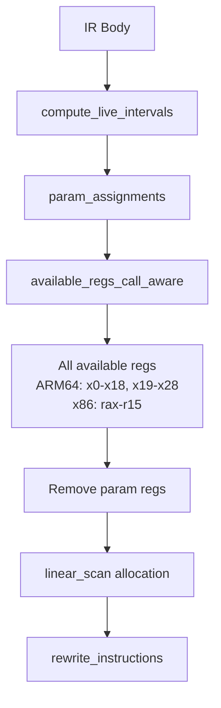
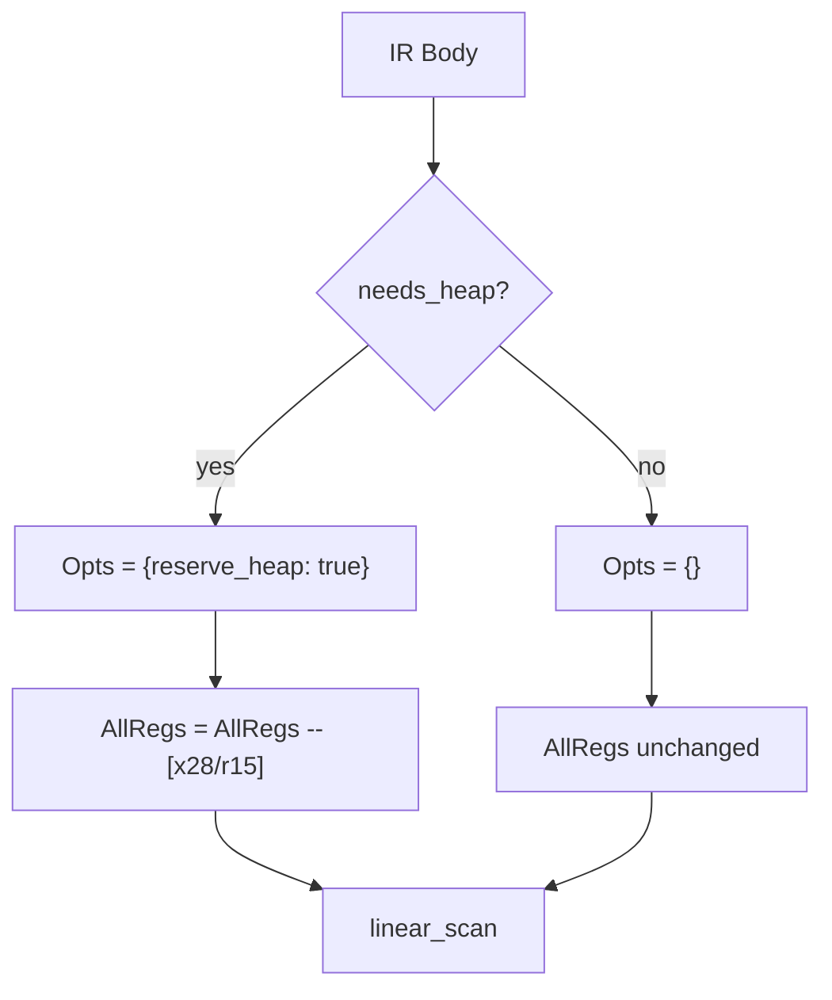

# Sketch: Reserve heap register in regalloc when data types are used

See primary sketch: thoughts/sketches/20260206-1655-phase6-native-data-types.md

COVERS:
- vbeam_rt/src/vbeam_native_regalloc.erl

## Current State

## What I'm Changing

When `reserve_heap` option is set (because string/array/struct/map ops exist):
- Remove x28 (ARM64) or r15 (x86_64) from the available register pool
- This prevents the allocator from assigning these regs to user variables
- The heap reg is used by alloc_init/alloc code emitted during lowering

## What Must NOT Break
- Existing programs without heap ops get the same register pool as before
- x28/r15 are only reserved when heap ops are actually present

## How I'll Verify It Works
- [ ] hello_arm64.ir still compiles and runs (no heap ops, x28 available)
- [ ] strings_arm64.ir compiles without x28 conflict
