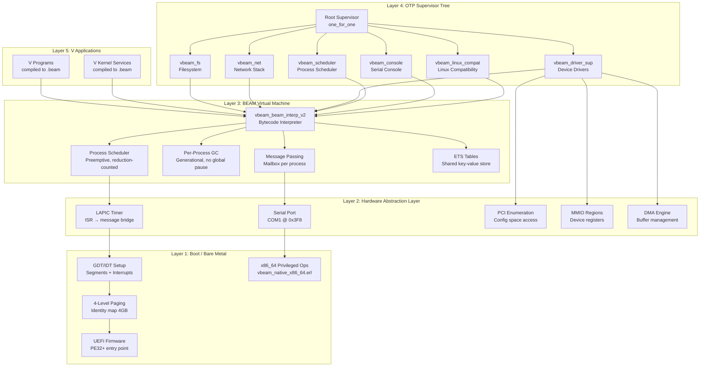
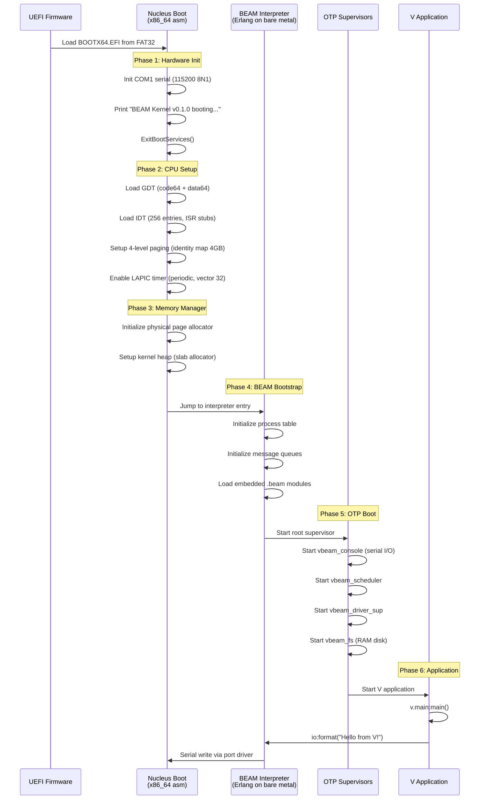
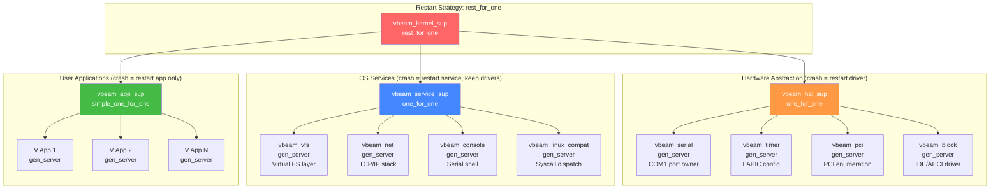
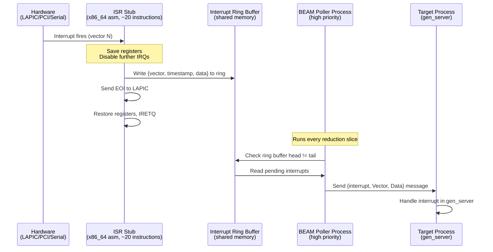
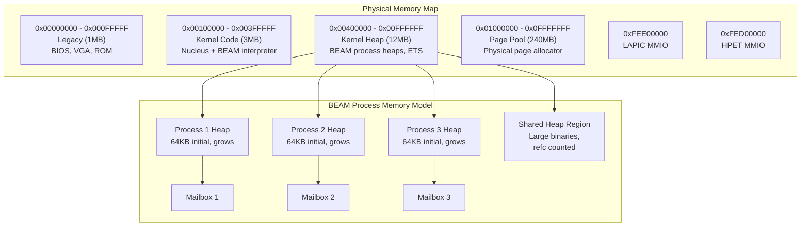
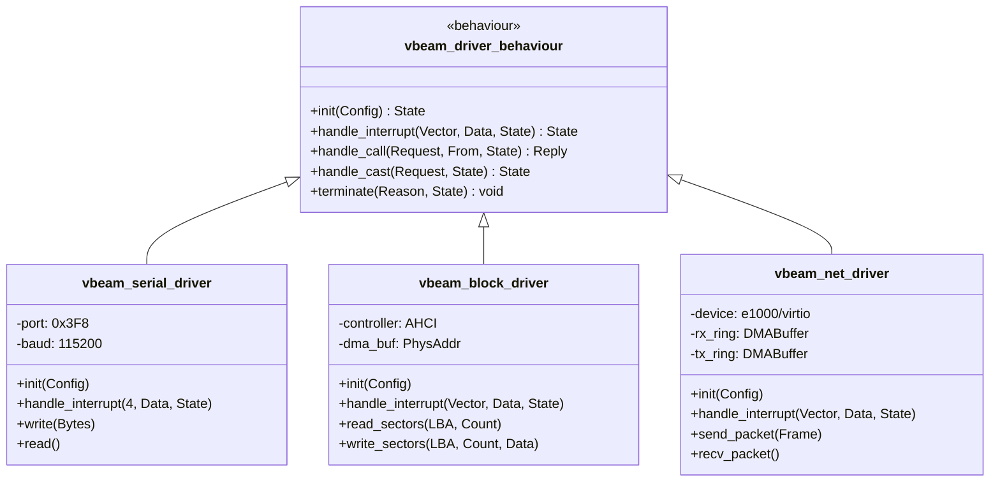

# Sketch: V-on-BEAM OS Nucleus — QNX-Like Reliability Architecture

COVERS:
- os/nucleus/vbeam_nucleus_boot.erl
- os/beam_vm/vbeam_beam_interp_v2.erl
- os/compat/linux_syscalls/vbeam_linux_syscall.erl
- os/compat/linux_ko_loader/vbeam_elf_loader.erl
- os/compat/linuxkpi/vbeam_linuxkpi.erl
- vbeam_rt/src/vbeam_native_pe.erl
- vbeam_rt/src/vbeam_native_x86_64.erl

---

## 1. Design Philosophy: BEAM IS the Microkernel

QNX's reliability comes from: tiny trusted kernel + everything else in user-space processes
communicating via message passing. BEAM already IS this model:

| QNX Concept | BEAM Equivalent | Our Implementation |
|---|---|---|
| Microkernel (~100KB) | BEAM scheduler + GC | `vbeam_beam_interp_v2.erl` on bare metal |
| Resource managers | OTP gen_servers | Supervised Erlang processes |
| Message passing IPC | Erlang `!` operator | Zero-copy on bare metal (shared heap region) |
| Process isolation | MMU + address spaces | BEAM process heaps (software isolation) |
| Transparent restart | QNX restart policy | OTP supervisor strategies |
| Interrupt → pulse | QNX pulse mechanism | ISR → BEAM message bridge |
| Adaptive partitioning | QNX APS | Per-process reduction budgets |

**Key insight**: We don't need to BUILD a microkernel — we need to RUN one on bare metal.
The BEAM VM IS the microkernel. Our job is the boot sequence to get there.

---

## 2. System Overview — Full Stack



---

## 3. Boot Sequence — UEFI to V Hello World



---

## 4. QNX Reliability Patterns — Mapped to BEAM

### 4a. Supervisor Tree (Heart of Reliability)



**Why `rest_for_one` at root**: If HAL crashes, services that depend on it also restart.
If a service crashes, HAL keeps running (drivers stay alive). Apps are independent.

### 4b. Crash Isolation Guarantees

```
Driver crashes?
  → HAL supervisor restarts just that driver
  → Other drivers unaffected
  → Services temporarily lose access, retry on reconnect

Service crashes?
  → Service supervisor restarts it
  → Drivers keep running (hardware state preserved)
  → Applications get {:EXIT, ...} messages, can handle gracefully

Application crashes?
  → App supervisor restarts it
  → Zero impact on drivers or services
  → Other applications unaffected

Interpreter bug?
  → This is the one thing that kills everything
  → Mitigation: watchdog timer (hardware), triple modular redundancy for critical paths
```

---

## 5. Interrupt → Message Bridge



**Why a ring buffer, not direct message send from ISR?**
- ISR runs with interrupts disabled — must be FAST (< 1 microsecond)
- BEAM message send involves heap allocation — too slow/complex for ISR
- Ring buffer is lock-free, fixed-size, O(1) write
- BEAM poller process converts hardware events to messages safely

**This is exactly how QNX does it**: hardware interrupts create "pulses" (lightweight messages)
that are delivered to resource manager threads. Our ring buffer IS the pulse mechanism.

---

## 6. Memory Architecture



**QNX comparison**:
- QNX uses MMU for process isolation (hardware enforced)
- BEAM uses software isolation (each process has its own heap, no pointer sharing)
- For Phase 1: software isolation is sufficient (BEAM already guarantees it)
- For Phase 2: we CAN add MMU-backed isolation for defense-in-depth
  (each BEAM process in its own page table, like Singularity OS)

---

## 7. Driver Model — gen_server Based



**Each driver is a supervised gen_server**:
- Owns its hardware resources (I/O ports, MMIO regions, IRQ vectors)
- Registers for interrupts via the interrupt bridge
- Crashes are caught by `vbeam_hal_sup` and the driver restarts
- Hardware state is re-initialized on restart (like QNX resource manager restart)

---

## 8. Linux Compatibility Layer

```mermaid
flowchart TD
    subgraph "V Application (compiled to .beam)"
        VAPP[V code calling<br>C.open, C.read, C.write]
    end

    subgraph "Syscall Bridge"
        STUB[vbeam codegen intercepts<br>C function calls]
        STUB --> DISPATCH[vbeam_linux_syscall:dispatch/2<br>~450 syscalls]
    end

    subgraph "LinuxKPI Shims"
        DISPATCH --> |"open/read/write"| VFS_SHIM[vbeam_vfs gen_server]
        DISPATCH --> |"socket/connect/send"| NET_SHIM[vbeam_net gen_server]
        DISPATCH --> |"mmap/brk"| MEM_SHIM[Memory manager]
        DISPATCH --> |"ioctl"| DRV_SHIM[Driver dispatch]
    end

    subgraph "Kernel Module Loading"
        KO[Linux .ko files<br>ELF64 relocatable]
        KO --> ELF[vbeam_elf_loader:parse/1<br>Parse ELF headers + sections]
        ELF --> RESOLVE[resolve_symbols/2<br>Link against vbeam_linuxkpi]
        RESOLVE --> LOAD[apply_relocations/2<br>Fixup addresses]
        LOAD --> EXEC[Execute init_module()]
    end

    VAPP --> STUB
    VFS_SHIM --> |"file ops"| BLK_DRV[vbeam_block_driver]
    NET_SHIM --> |"packets"| NET_DRV[vbeam_net_driver]
```

**This is our "personality layer"** (QNX term): the BEAM kernel speaks BEAM natively,
but can present a Linux personality for compatibility with existing V programs that call
POSIX functions. Just like QNX can run POSIX apps on its microkernel.

---

## 9. What Exists Now vs What's Needed

### Exists (Built in Wave 2)

| Component | File | Status | LOC |
|---|---|---|---|
| UEFI boot | `os/nucleus/vbeam_nucleus_boot.erl` | Working in QEMU | 577 |
| PE32+ emitter | `vbeam_rt/src/vbeam_native_pe.erl` | Working, 2 bugs fixed | 361 |
| BEAM interpreter | `os/beam_vm/vbeam_beam_interp_v2.erl` | Compiles, untested on bare metal | ~400 |
| ELF loader | `os/compat/linux_ko_loader/vbeam_elf_loader.erl` | Compiles | ~500 |
| Linux syscalls | `os/compat/linux_syscalls/vbeam_linux_syscall.erl` | Compiles, ~450 stubs | ~800 |
| LinuxKPI | `os/compat/linuxkpi/vbeam_linuxkpi.erl` | Compiles, 66 shims | ~600 |
| x86_64 encoder | `vbeam_rt/src/vbeam_native_x86_64.erl` | Working, 53 privileged ops | ~1700 |

### Needed (Wave 3 — Getting to Bare-Metal V)

| Phase | Component | Description | Depends On |
|---|---|---|---|
| 3a | Full boot sequence | GDT + IDT + paging in nucleus | Nucleus (done) |
| 3b | Memory manager | Physical page allocator + kernel heap | Full boot |
| 3c | Interrupt bridge | ISR stubs → ring buffer → BEAM poller | IDT + memory |
| 3d | BEAM on bare metal | Wire interp_v2 into nucleus | Memory + interrupts |
| 3e | Serial driver | gen_server wrapping COM1 | BEAM running |
| 3f | Console shell | Interactive Erlang shell over serial | Serial driver |
| 3g | V hello world | Compile V → .beam → run on bare metal | Console |

### Future (Wave 4 — Production Reliability)

| Phase | Component | Description |
|---|---|---|
| 4a | PCI enumeration | Discover devices on PCI bus |
| 4b | Block driver | IDE/AHCI disk driver (gen_server) |
| 4c | Network driver | e1000/virtio-net driver (gen_server) |
| 4d | VFS layer | Virtual filesystem with RAM disk |
| 4e | TCP/IP stack | Lightweight TCP/IP in Erlang |
| 4f | MMU isolation | Hardware-backed process isolation |
| 4g | Watchdog | Hardware timer-based health monitor |
| 4h | Hot code reload | OTP release handler on bare metal |

---

## 10. Wave 3 Implementation Order (Critical Path)

```mermaid
gantt
    title Wave 3: UEFI → Bare-Metal V Hello World
    dateFormat X
    axisFormat %s

    section Boot
    Full boot (GDT+IDT+Paging)    :a1, 0, 2
    Memory manager (pages+heap)    :a2, after a1, 2

    section Interrupts
    ISR stubs + ring buffer        :b1, after a2, 1
    BEAM poller process            :b2, after b1, 1

    section BEAM Runtime
    Wire interp_v2 into nucleus    :c1, after a2, 2
    Embed .beam modules in PE      :c2, after c1, 1
    Process scheduler              :c3, after c2 b2, 2

    section I/O
    Serial port driver             :d1, after c3, 1
    Console shell                  :d2, after d1, 1

    section Milestone
    V hello world on bare metal    :milestone, after d2, 0
```



---

## 11. What Must NOT Break (Invariants)

1. **ISR latency < 1 microsecond** — ISR stubs do ring buffer write + EOI, nothing else
2. **No heap allocation in ISR context** — all allocation happens in BEAM processes
3. **Supervisor tree never has single points of failure** — every critical service is supervised
4. **Driver crash never corrupts kernel state** — drivers own their state, supervisor restarts clean
5. **BEAM GC never pauses other processes** — per-process heaps, generational GC
6. **Message passing is the ONLY IPC** — no shared mutable state between processes
7. **Serial console always recoverable** — if console process crashes, supervisor restarts it

## 12. How We'll Verify

- [ ] `make qemu` — Full boot to serial output (exists, passing)
- [ ] `make qemu-interp` — BEAM interpreter executes hello.beam on bare metal
- [ ] `make qemu-otp` — OTP supervisor tree starts, serial console interactive
- [ ] `make qemu-vhello` — V-compiled .beam runs on bare metal, prints to serial
- [ ] Stress test: spawn 10,000 processes, verify supervisor restarts on crashes
- [ ] Chaos test: kill random driver processes, verify automatic restart
- [ ] Latency test: measure interrupt-to-message time, must be < 100 microseconds
