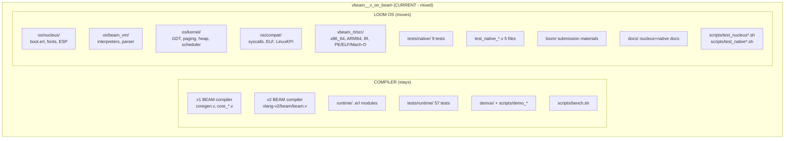
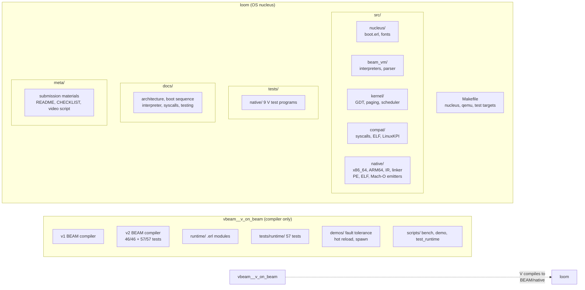
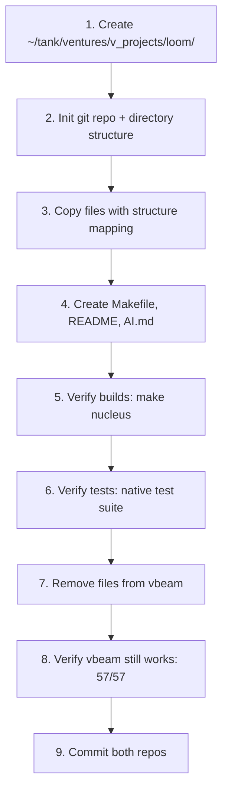

# Sketch: Loom Project Migration

COVERS:
- os/** (nucleus, beam_vm, kernel, compat)
- vbeam_rt/src/** (native backends)
- tests/native/** (native test suite)
- loom/** (presentation materials)
- docs/ (nucleus/native-related)
- scripts/ (nucleus/native test scripts)

## Current State: Everything in vbeam

## After Migration: Clean Separation

## Migration Steps

## Directory Mapping

| Source (vbeam) | Target (loom) |
|---|---|
| `os/nucleus/` | `src/nucleus/` |
| `os/beam_vm/` | `src/beam_vm/` |
| `os/kernel/` | `src/kernel/` |
| `os/compat/` | `src/compat/` |
| `vbeam_rt/src/vbeam_native*.erl` | `src/native/` |
| `tests/native/` | `tests/native/` |
| `test_native_*.v` | `tests/native/` (consolidated) |
| `loom/` | `meta/` (submission materials) |
| `docs/nucleus-*.md` | `docs/` |
| `docs/beam-interpreter.md` | `docs/` |
| `docs/native-*.md` | `docs/` |
| `docs/elf-ko-loader.md` | `docs/` |
| `docs/linux-syscall-table.md` | `docs/` |
| `docs/linuxkpi-surface.md` | `docs/` |
| `scripts/test_nucleus_qemu.sh` | `scripts/` |
| `scripts/test_native_*.sh` | `scripts/` |
| `scripts/render_font_bitmap.py` | `scripts/` |
| `thoughts/sketches/*nucleus*` | `thoughts/sketches/` |
| `thoughts/sketches/*native*` | `thoughts/sketches/` |
| `thoughts/sketches/*loom*` | `thoughts/sketches/` |
| `preview_monaspice.png` | `assets/` |
| Makefile nucleus targets | `Makefile` (standalone) |

## What Must NOT Break

- vbeam 57/57 runtime tests must still pass after removal
- vbeam demos (fault tolerance, hot reload, spawn) must still work
- `make nucleus` must work from loom directory
- QEMU boot must work from loom directory
- Native test scripts must find their modules

## How I'll Verify

- [ ] `cd loom && make nucleus` builds nucleus.efi
- [ ] `cd loom && make qemu-test` boots (if QEMU available)
- [ ] `cd vbeam && bash scripts/test_runtime.sh` still 57/57
- [ ] `cd vbeam && bash demos/hackathon_showcase.sh` still runs
- [ ] All .erl files compile with erlc in new location
