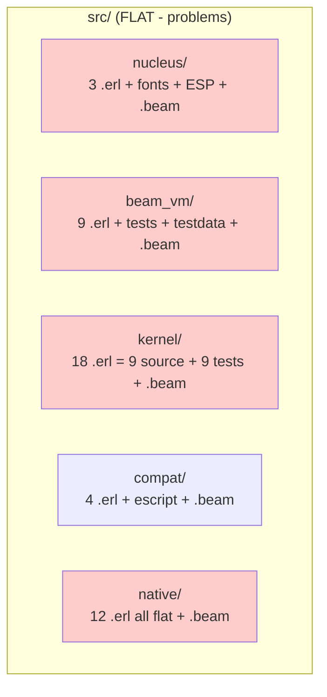
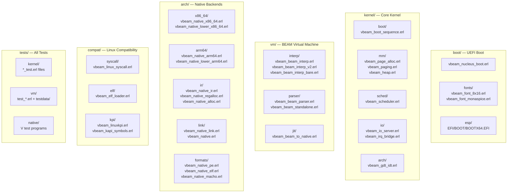

# Sketch: Loom OS Directory Refactor

COVERS:
- All files under src/ (46 .erl modules)
- tests/ reorganization
- scripts/ consolidation
- Build system overhaul

## Current State (flat dump from migration)

**Problems:**
1. Tests mixed with source (kernel/ has 9 test files)
2. .beam artifacts scattered in source dirs
3. Flat namespaces (native/ has 12 unrelated files)
4. No subsystem READMEs
5. Scripts scattered across subsystems
6. No clear "where does X go?" answer

## Target State (OS-style hierarchy)

## File Mapping

| From | To | Why |
|------|-----|-----|
| `src/nucleus/vbeam_nucleus_boot.erl` | `boot/vbeam_nucleus_boot.erl` | Boot is its own top-level subsystem |
| `src/nucleus/vbeam_font_*.erl` | `boot/fonts/` | Fonts are boot-only |
| `src/nucleus/esp/` | `boot/esp/` | ESP partition structure |
| `src/kernel/vbeam_boot_sequence.erl` | `kernel/boot/` | Boot orchestration subsystem |
| `src/kernel/vbeam_page_alloc.erl` | `kernel/mm/` | Memory management |
| `src/kernel/vbeam_paging.erl` | `kernel/mm/` | Memory management |
| `src/kernel/vbeam_heap.erl` | `kernel/mm/` | Memory management |
| `src/kernel/vbeam_scheduler.erl` | `kernel/sched/` | Scheduler subsystem |
| `src/kernel/vbeam_io_server.erl` | `kernel/io/` | I/O subsystem |
| `src/kernel/vbeam_irq_bridge.erl` | `kernel/io/` | IRQ is part of I/O |
| `src/kernel/vbeam_gdt_idt.erl` | `kernel/arch/` | Architecture-specific |
| `src/kernel/vbeam_beam_to_native.erl` | `vm/jit/` | JIT is VM concern |
| `src/beam_vm/vbeam_beam_interp*.erl` | `vm/interp/` | Interpreter subsystem |
| `src/beam_vm/vbeam_beam_parser.erl` | `vm/parser/` | Parser subsystem |
| `src/beam_vm/vbeam_beam_standalone.erl` | `vm/parser/` | Parser subsystem |
| `src/beam_vm/*.escript` | `tools/` | Utility scripts |
| `src/native/vbeam_native_x86_64.erl` | `arch/x86_64/` | Arch-specific |
| `src/native/vbeam_native_lower_x86_64.erl` | `arch/x86_64/` | Arch-specific |
| `src/native/vbeam_native_arm64.erl` | `arch/arm64/` | Arch-specific |
| `src/native/vbeam_native_lower_arm64.erl` | `arch/arm64/` | Arch-specific |
| `src/native/vbeam_native_ir.erl` | `arch/ir/` | IR shared across arches |
| `src/native/vbeam_native_regalloc.erl` | `arch/ir/` | Regalloc shared |
| `src/native/vbeam_native_alloc.erl` | `arch/ir/` | Alloc shared |
| `src/native/vbeam_native_link.erl` | `arch/link/` | Linker shared |
| `src/native/vbeam_native.erl` | `arch/link/` | Entry point |
| `src/native/vbeam_native_pe.erl` | `arch/formats/` | Object format |
| `src/native/vbeam_native_elf.erl` | `arch/formats/` | Object format |
| `src/native/vbeam_native_macho.erl` | `arch/formats/` | Object format |
| `src/compat/vbeam_linux_syscall.erl` | `compat/syscall/` | Syscall subsystem |
| `src/compat/vbeam_elf_loader.erl` | `compat/elf/` | ELF loader |
| `src/compat/vbeam_linuxkpi.erl` | `compat/kpi/` | KPI shims |
| `src/compat/vbeam_kapi_symbols.erl` | `compat/kpi/` | KPI symbols |
| `src/compat/test_elf_loader.escript` | `tools/` | Utility script |
| All `*_test.erl` from kernel | `tests/kernel/` | Tests separated |
| All `test_*.erl` from beam_vm | `tests/vm/` | Tests separated |
| `src/beam_vm/testdata/` | `tests/data/` | Test data |
| All scripts/* | `tools/` | Consolidated |

## What Must NOT Break

- `make nucleus` must build 5120-byte nucleus.efi
- All kernel test modules must compile and pass
- .erl files must be findable by Makefile for compilation
- ESP partition structure must remain intact

## Build System Best Practices

- Automatic dependency discovery (find all .erl files)
- Parallel compilation (-j support)
- Per-subsystem targets (make boot, make kernel, make vm, etc.)
- Color output with [OK]/[FAIL] markers
- make help with aligned descriptions
- make test runs all test suites
- make clean / make distclean separation
- Proper .PHONY declarations
- Variable overrides for cross-compilation
